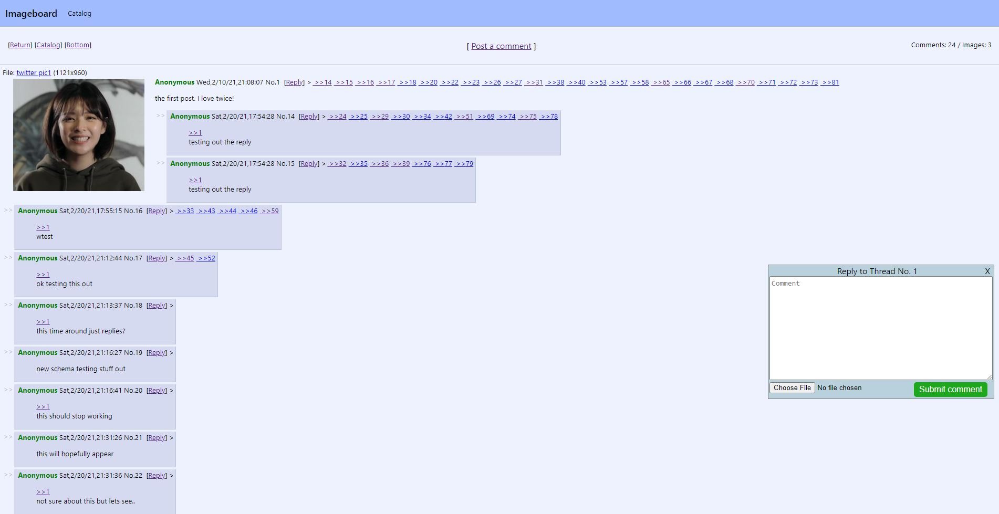

# ImageBoard(MySQL version)

A MySQL version of the original Imageboard app. It retains the same features and frontend as the original. Imageboard is a web app where users can anonymously post messages and share images under certain thread topics. It currently supports jpg/jpeg, gif and webm formatted media.

## Installation
Clone repo and check into this branch
```
git clone -b mysql_implementation https://github.com/AlisonWonderland/ImageBoard.git
```

Install dev dependencies in both root folder and backend using:
```
npm install
```

Install Memcached
```
sudo apt update
sudo apt install memcached
sudo apt install libmemcached-tools
```
Here's a link for further installation options: https://www.digitalocean.com/community/tutorials/how-to-install-and-secure-memcached-on-ubuntu-18-04


Install MySQL
```
Follow steps here: https://www.digitalocean.com/community/tutorials/how-to-install-mysql-on-ubuntu-20-04
```

## Running the app

First start up Memcached. Note that the app will still work without starting Memcached, but will cause a large delay in fetching data from the api.
```
sudo service memcached start
```

A success message should appear.

Next, start up MySQL
```
sudo service mysql start

or use if you have socket issues

sudo mkdir -p /var/run/mysqld; sudo chown mysql /var/run/mysqld
sudo mysqld_safe --skip-grant-tables &
```

To start frontend, go to root directory and execute
```
npm start
```

And finally to start backend go to backend directory and execute
```
npm run dev
```
to run in dev mode using nodemon or use
```
npm start
```
to run backend without nodemon

## Tech used
* MySQL
    * To store comments and threads.
* Express
* React
* Node.js
* Memcached
    * To cache MongoDB queries and reduce the strain on the database
    * To speed up response times
* AWS S3 Bucket
    * To store uploaded images and their thumbnails
    * To provide links to images
    * I used the Node.js AWS S3 SDK to interact with my bucket
    * I added cache-control to my images so that they could be seen in new tabs
* Jest 
    * To test some api routes

## Screenshots

### Home page showing thread previews

### Home page with create thread form showing

### Catalog page

### Full Thread


## Important feature notes
* Sometimes replies won't update because they're not in cache yet.

### Performance notes
* Current benchmark webm + thumbnail upload is ~8 seconds 
* Current benchmark jpg + thumbnail upload is ~1.1 seconds 